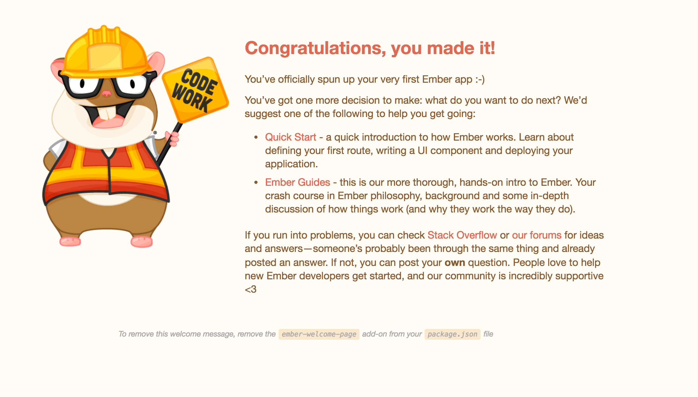

Welcome to the Ember Tutorial! This tutorial is meant to introduce basic Ember concepts while creating a professional looking application. If you get stuck at any point during the tutorial feel free to visit <https://github.com/ember-learn/super-rentals> for a working example of the completed app.

Ember CLI, Ember's command line interface, provides a standard project structure, a set of development tools, and an addon system. This allows Ember developers to focus on building apps rather than building the support structures that make them run. From your command line, a quick `ember --help` shows the commands Ember CLI provides. For more information on a specific command, type `ember help <command-name>`.

## 创建一个新应用程序

To create a new project using Ember CLI, use the `new` command. In preparation for the tutorial in the next section, you can make an app called `super-rentals`.

```shell
ember new super-rentals
```

## 目录结构

The `new` command generates a project structure with the following files and directories:

```text
|--app
|--bower_components
|--config
|--dist
|--node_modules
|--public
|--tests
|--tmp
|--vendor

bower.json
ember-cli-build.js
package.json
README.md
testem.js
```

Let's take a look at the folders and files Ember CLI generates.

**app**: This is where folders and files for models, components, routes, templates and styles are stored. The majority of your coding on an Ember project happens in this folder.

**bower_components / bower.json**: Bower is a dependency management tool. It is used in Ember CLI to manage front-end plugins and component dependencies (HTML, CSS, JavaScript, etc). All Bower components are installed in the `bower_components` directory. If we open `bower.json`, we see the list of dependencies that are installed automatically including Ember, Ember CLI Shims, and QUnit (for testing). If we add additional front-end dependencies, such as Bootstrap, we will see them listed here, and added to the `bower_components` directory.

**config**: The config directory contains the `environment.js` where you can configure settings for your app.

**dist**: When we build our app for deployment, the output files will be created here.

**node_modules / package.json**: This directory and file are from npm. npm is the package manager for Node.js. Ember is built with Node and uses a variety of Node.js modules for operation. The `package.json` file maintains the list of current npm dependencies for the app. Any Ember CLI add-ons you install will also show up here. Packages listed in `package.json` are installed in the node_modules directory.

**public**: This directory contains assets such as images and fonts.

**vendor**: This directory is where front-end dependencies (such as JavaScript or CSS) that are not managed by Bower go.

**tests / testem.js**: Automated tests for our app go in the `tests` folder, and Ember CLI's test runner **testem** is configured in `testem.js`.

**tmp**: Ember CLI temporary files live here.

**ember-cli-build.js**: This file describes how Ember CLI should build our app.

## ES6 模块

If you take a look at `app/router.js`, you'll notice some syntax that may be unfamiliar to you.

```app/router.js import Ember from 'ember'; import config from './config/environment';

const Router = Ember.Router.extend({ location: config.locationType, rootURL: config.rootURL });

Router.map(function() { });

export default Router;

    <br />Ember CLI 使用 ECMAScript 2015（简称 ES2015，以前也叫 ES6）模块来组织应用程序代码。
    比如说 `import Ember from 'ember';` 这一行，让我们可以通过 `Ember` 变量来访问实际的 Ember.js 库。 而 `import config from './config/environment';` 这一行则让我们可以通过 `config` 变量来访问程序的配置数据。 `const` 是一种声明只读变量的方法，以确保该变量的值不会在其它地方被误更改。 在文件的末尾，`export default Router;` 使得此文件中定义的 `Router` 变量可以从应用程序的其它地方来调用。
    
    ## 升级 Ember
    
    在继续本教程之前，首先确保你安装的是最新版本的 Ember和Ember Data。 如果 `bower.json` 中 `ember` 和 `ember-data` 的版本号低于这篇指南左上角显示的版本号，请更新 `bower.json` 中的两个版本号，然后执行 `bower install`升级。
    同样，如果`ember-data`在`package.json`是较低版本，则更改版本号，然后运行 `npm install`升级。
    
    ## 开发模式启动服务器
    
    当我们的新项目已经准备就绪，我们可以通过下面的命令启动服务器来确保一切运转正常。
    
    ```shell
    ember server
    

or, for short:

```shell
ember s
```

If we navigate to [`http://localhost:4200`](http://localhost:4200), we'll see the default welcome screen. Once we add our own `app/templates/application.hbs` file, the welcome screen will be replaced with our own content.

