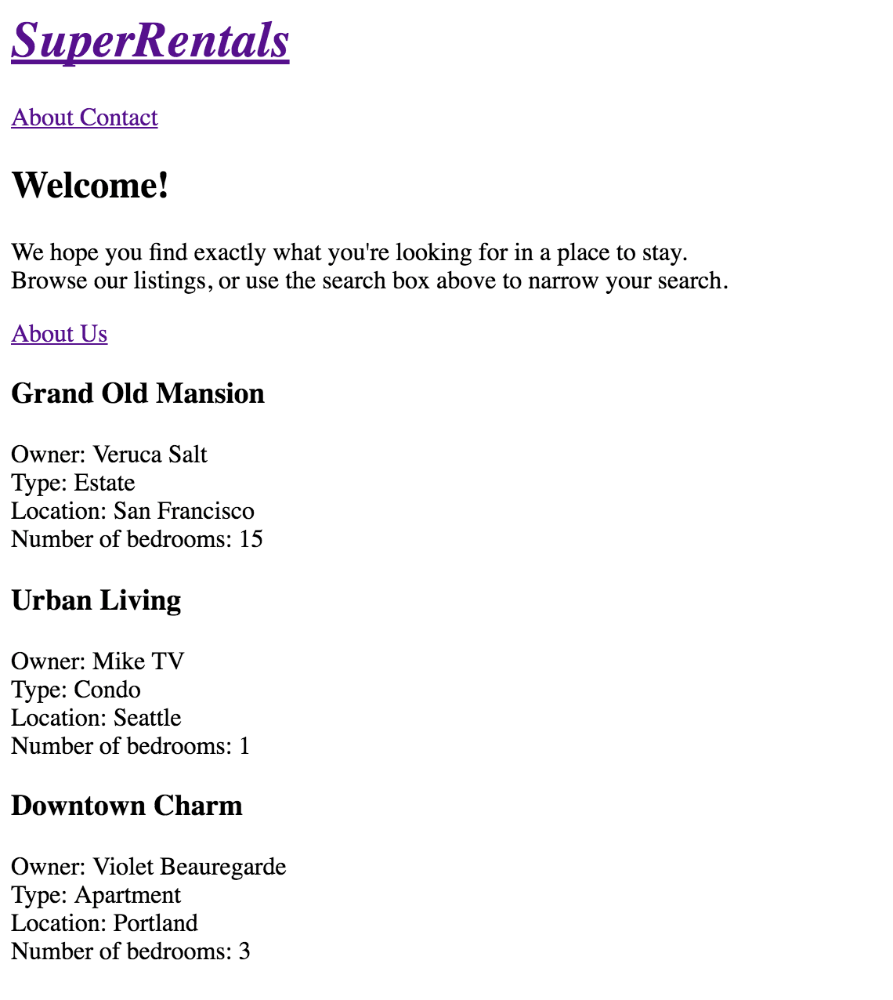

それでは、index テンプレートに利用可能な賃貸物件のリストを追加していきましょう。 賃貸物件はゆくゆくはユーザーが追加、更新、削除できるようにするので、静的なものにはなりません。 そのため、*rentals*モデルを用意し、そこに賃貸物件の情報を保存しておく必要があります。 まずはシンプルに、ハードコードした JavaScript オブジェクトの配列を使用します。 その後で、アプリケーションのデータをしっかりと管理するよう、Ember Dataを利用する形に置き換えいきます。

完成したホームページは次のようになります。



Emberでは、route (ルート) ハンドラがモデルのデータを読み込む責務を担います。`app/routes/index.js` を開いて、`model`フックの値を返すように、ハードコードデータを追加しましょう。

```app/routes/rentals.js import Ember from 'ember';

let rentals = [{ id: 'grand-old-mansion', title: 'Grand Old Mansion', owner: 'Veruca Salt', city: 'San Francisco', type: 'Estate', bedrooms: 15, image: 'https://upload.wikimedia.org/wikipedia/commons/c/cb/Crane_estate_(5).jpg' }, { id: 'urban-living', title: 'Urban Living', owner: 'Mike TV', city: 'Seattle', type: 'Condo', bedrooms: 1, image: 'https://upload.wikimedia.org/wikipedia/commons/0/0e/Alfonso_13_Highrise_Tegucigalpa.jpg' }, { id: 'downtown-charm', title: 'Downtown Charm', owner: 'Violet Beauregarde', city: 'Portland', type: 'Apartment', bedrooms: 3, image: 'https://upload.wikimedia.org/wikipedia/commons/f/f7/Wheeldon_Apartment_Building_-_Portland_Oregon.jpg' }];

export default Ember.Route.extend({ model() { return rentals; } });

    <br />ここでは、`model: function()`と同意義のES6メソッド 簡略構文の `model()`で書いています。
    
    `model`関数は **フック** として機能します。これは、Emberがアプリケーションの様々な場面でそれを呼び出すことを意味しています。
    `rentals` route (ルート)に追加した model (モデル)フックは、ユーザーが`rentals` route (ルート)に入った時に呼び出されます。
    
    `model`フックは_rentals_配列を返します。そして、`model`属性としてその配列を`rentals`テンプレートに渡します。
    
    では、テンプレートを見てみましょう。　　
    モデルデータをリストの表示のために利用できます。
    ここでは、別のよく使われる、`{{each}}`と呼ばれる、Handlebarsヘルパーを利用します。
    このヘルパーはモデルの各オブジェクトをループするのに役立ちます。
    
    ```app/templates/rentals.hbs{+13,+14,+15,+16,+17,+18,+19,+20,+21,+22,+23,+24,+25,+26,+27,+28,+29}
    <div class="jumbo">
      <div class="right tomster"></div>
      <h2>Welcome!</h2>
      <p>
        We hope you find exactly what you're looking for in a place to stay.
        <br>Browse our listings, or use the search box below to narrow your search.
      </p>
      {{#link-to 'about' class="button"}}
        About Us
      {{/link-to}}
    </div>
    
    {{#each model as |rental|}}
      <article class="listing">
        <h3>{{rental.title}}</h3>
        <div class="detail owner">
          <span>Owner:</span> {{rental.owner}}
        </div>
        <div class="detail type">
          <span>Type:</span> {{rental.type}}
        </div>
        <div class="detail location">
          <span>Location:</span> {{rental.city}}
        </div>
        <div class="detail bedrooms">
          <span>Number of bedrooms:</span> {{rental.bedrooms}}
        </div>
      </article>
    {{/each}}
    

このテンプレートでは、それぞれのモデルオブジェクトを*rental*と呼びます。各レンタル品のプロパティについての情報を一覧として作成します。

これにより、物件を表示できるようになりました、受入テストが通るようになっているはずです。

