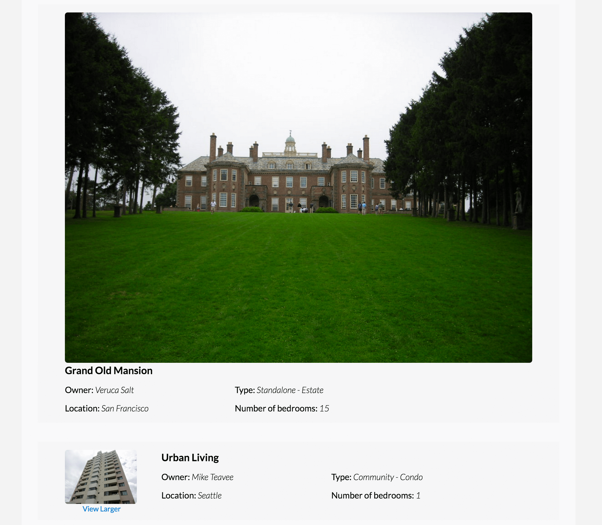

As a user looks through our list of rentals, they may want to have some interactive options to help them make a decision. Let's add the ability to toggle the size of the image for each rental. To do this, we'll use a component.

Let's generate a `rental-listing` component that will manage the behavior for each of our rentals. 每个组件component的名字需要加入中画线，用以避免跟可能的HTML元素命名冲突。 所以 `rental-listing`是一个可以接受的组件名称，而 `rental`则不是。

```shell
ember g component rental-listing
```

Ember CLI will then generate a handful of files for our component:

```shell
installing component
  create app/components/rental-listing.js
  create app/templates/components/rental-listing.hbs
installing component-test
  create tests/integration/components/rental-listing-test.js
```

我们开始创建一个验证失败的测试用例 用来测试我们图片的开关功能。

For our integration test, we'll create a stub rental that has all the properties that our rental model has. We will assert that the component is initially rendered without the `wide` class name. Clicking the image will add the class `wide` to our element, and clicking it a second time will take the `wide` class away. Note that we find the image element using the CSS selector `.image`.

```tests/integration/components/rental-listing-test.js import { moduleForComponent, test } from 'ember-qunit'; import hbs from 'htmlbars-inline-precompile'; import Ember from 'ember';

moduleForComponent('rental-listing', 'Integration | Component | rental listing', { integration: true });

test('should toggle wide class on click', function(assert) { assert.expect(3); let stubRental = Ember.Object.create({ image: 'fake.png', title: 'test-title', owner: 'test-owner', type: 'test-type', city: 'test-city', bedrooms: 3 }); this.set('rentalObj', stubRental); this.render(hbs`{{rental-listing rental=rentalObj}}`); assert.equal(this.$('.image.wide').length, 0, 'initially rendered small'); this.$('.image').click(); assert.equal(this.$('.image.wide').length, 1, 'rendered wide after click'); this.$('.image').click(); assert.equal(this.$('.image.wide').length, 0, 'rendered small after second click'); });

    <br />一个模板 分为两部分：
    *  一个用来定义如何显示的模板。
    (`app/templates/components/rental-listing.hbs`)
    *  一个用来记录交互操作的javascript代码文件。
    
    Our new `rental-listing` component will manage how a user sees and interacts with a rental.
    着手行动，我们先把一个出租房屋的详细信息从“rentals.hbs”模板页面移到刚创建的“rental-listing.hbs”组件中并添加图片。
    
    ```app/templates/components/rental-listing.hbs{+2}
    <article class="listing">
      
      <h3>{{rental.title}}</h3>
      <div class="detail owner">
        <span>Owner:</span> {{rental.owner}}
      </div>
      <div class="detail type">
        <span>Type:</span> {{rental.type}}
      </div>
      <div class="detail location">
        <span>Location:</span> {{rental.city}}
      </div>
      <div class="detail bedrooms">
        <span>Number of bedrooms:</span> {{rental.bedrooms}}
      </div>
    </article>
    

在`rentals.hbs`模板页面的出租信息`{{#each}}`循环体中HTML代码替换成新创建的 `rental-listing` 组件。

```app/templates/rentals.hbs{+12,+13,-14,-15,-16,-17,-18,-19,-20,-21,-22,-23,-24,-25,-26,-27,-28,-29} 

<div class="jumbo">
  <div class="right tomster">
  </div>
  
  <h2>
    Welcome!
  </h2>
  
  <p>
    We hope you find exactly what you're looking for in a place to stay.
  </p> {{#link-to 'about' class="button"}} About Us {{/link-to}}
</div>

{{#each model as |rentalUnit|}} {{rental-listing rental=rentalUnit}} {{#each model as |rental|}} <article class="listing"> 

### {{rental.title}}

<div class="detail owner">
  <span>Owner:</span> {{rental.owner}}
</div>

<div class="detail type">
  <span>Type:</span> {{rental.type}}
</div>

<div class="detail location">
  <span>Location:</span> {{rental.city}}
</div>

<div class="detail bedrooms">
  <span>Number of bedrooms:</span> {{rental.bedrooms}}
</div></article> {{/each}}

    这里我们用组件的名字“rental-listing”调用组件，并把 每个“rentalUnit”对象作为组件的“rental” 属性传人到组件中。
    
    ## Hiding and Showing an Image
    
    Now we can add functionality that will show the image of a rental when requested by the user.
    
    Let's use the `{{if}}` helper to show our current rental image larger only when `isWide` is set to true, by setting the element class name to `wide`. We'll also add some text to indicate that the image can be clicked on, and wrap both with an anchor element, giving it the `image` class name so that our test can find it.
    
    ```app/templates/components/rental-listing.hbs{+2,+4,+5}
    <article class="listing">
      <a class="image {{if isWide "wide"}}">
        
        <small>View Larger</small>
      </a>
      <h3>{{rental.title}}</h3>
      <div class="detail owner">
        <span>Owner:</span> {{rental.owner}}
      </div>
      <div class="detail type">
        <span>Type:</span> {{rental.type}}
      </div>
      <div class="detail location">
        <span>Location:</span> {{rental.city}}
      </div>
      <div class="detail bedrooms">
        <span>Number of bedrooms:</span> {{rental.bedrooms}}
      </div>
    </article>
    

The value of `isWide` comes from our component's JavaScript file, in this case `rental-listing.js`. Since we want the image to be smaller at first, we will set the property to start as `false`:

```app/components/rental-listing.js{+4} import Ember from 'ember';

export default Ember.Component.extend({ isWide: false });

    <br />To allow the user to widen the image, we will need to add an action that toggles the value of `isWide`.
    Let's call this action `toggleImageSize`
    
    ```app/templates/components/rental-listing.hbs{+2}
    <article class="listing">
      <a {{action 'toggleImageSize'}} class="image {{if isWide "wide"}}">
        
        <small>View Larger</small>
      </a>
      <h3>{{rental.title}}</h3>
      <div class="detail owner">
        <span>Owner:</span> {{rental.owner}}
      </div>
      <div class="detail type">
        <span>Type:</span> {{rental.type}}
      </div>
      <div class="detail location">
        <span>Location:</span> {{rental.city}}
      </div>
      <div class="detail bedrooms">
        <span>Number of bedrooms:</span> {{rental.bedrooms}}
      </div>
    </article>
    

Clicking the anchor element will send the action to the component. Ember will then go into the `actions` hash and call the `toggleImageSize` function. Let's create the `toggleImageSize` function and toggle the `isWide` property on our component:

```app/components/rental-listing.js{+5,+6,+7,+8,+9} import Ember from 'ember';

export default Ember.Component.extend({ isWide: false, actions: { toggleImageSize() { this.toggleProperty('isWide'); } } }); ```

Now when we click the image or the `View Larger` link in our browser, we see our image show larger. When we click the enlarged image again, we see it smaller.

